<a id="top"></a>

# 🎤 Podcastogist

> AI-Powered Podcast Post-Production Platform  
> Durable, real-time SaaS workflow pipeline that turns one upload into a full content kit:  
> upload → transcription → parallel AI jobs → live results

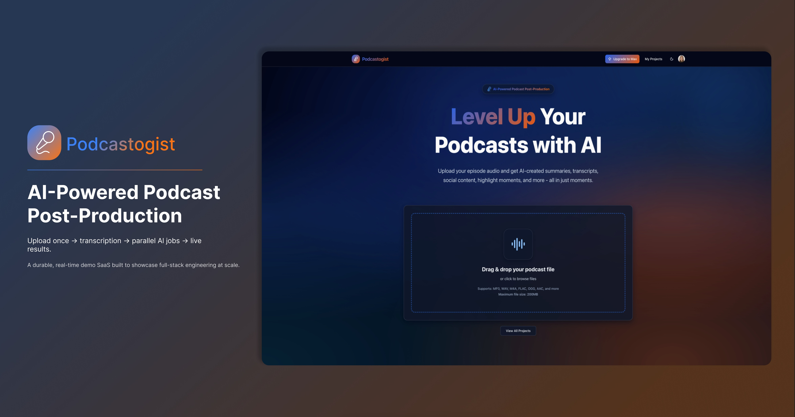

**Website:** https://podcastogist.com/  
**Repository:** https://github.com/lindsaycode05/podcastogist  
**Issues:** https://github.com/lindsaycode05/podcastogist/issues  
**LinkedIn:** https://www.linkedin.com/in/lindsaycode/

**Flagship Personal Project:** End-to-end SaaS build created to demonstrate full-stack product engineering depth.  
**Primary Audience:** Recruiters, hiring managers, and engineers reviewing architecture.  
**Build Effort:** ~194 hours (Dec 6 → Dec 26, 2025).


**At a glance:**

- 🚀 Upload podcast audio once, get recaps, social posts, highlights, hashtags, timestamps, and speaker dialogue.
- ⚡ Durable background orchestration via Inngest with parallel, webhook-driven AI tasks (no long-running HTTP).
- 🔐 Clerk-based authentication and plan gating (Free / Plus / Max).
- 📡 Real-time UI updates via Convex subscriptions (no polling).
- 🌗 Full dark mode + mobile-responsive UI.

---

<a id="quick-section-jump-buttons"></a>

## 📋 Table of Sections:

**📌 Product Overview**

- [What Podcastogist Is](#what-podcastogist-is)
- [Why It Exists](#why-it-exists)
- [Who It's For](#who-its-for)
- [What This Project Demonstrates](#what-this-project-demonstrates)
- [Feature Suite](#feature-suite)
- [Content Pack Output](#content-pack-output)
- [Workflow Snapshot](#workflow-snapshot)

**🎥 Media & UI**

- [Video Walkthrough](#video-walkthrough)
- [UI Tour](#ui-tour)

**💳 Plans & Gating**

- [Plans & Limits](#plans--limits)
- [Feature Gating Matrix](#feature-gating-matrix)
- [How Gating Works](#how-gating-works)

**🏗️ Architecture & Data**

- [Architecture Overview](#architecture-overview)
- [Parallel Orchestration](#parallel-orchestration)
- [Long-Running File Handling](#long-running-file-handling)
- [API Surface](#api-surface)
- [Event Contracts](#event-contracts)
- [Data Model](#data-model)
- [Project Status Model](#project-status-model)
- [Storage Layout](#storage-layout)
- [Security Model](#security-model)
- [Observability](#observability)

**🧠 AI & Processing**

- [AI Generation Engine](#ai-generation-engine)
- [AssemblyAI Transcription](#assemblyai-transcription)
- [Prompt & Schema Discipline](#prompt--schema-discipline)
- [Real-time Updates](#real-time-updates)
- [Retry & Regeneration](#retry--regeneration)
- [Failure Modes & Recovery](#failure-modes--recovery)
- [Tradeoffs](#tradeoffs)

**🎨 Design & UX**

- [Design System & UI](#design-system--ui)
- [UX Details](#ux-details)

**🧰 Engineering Notes**

- [Tech Stack](#tech-stack)
- [Repo Map](#repo-map)
- [Engineering Notes](#engineering-notes)
- [Build Challenges](#build-challenges)
- [Build Timeline](#build-timeline)

**🔮 Future & Wrap-up**

- [Roadmap](#roadmap)
- [Glossary](#glossary)
- [Demo Disclaimer](#demo-disclaimer)
- [Contact](#contact)

---

<a id="what-podcastogist-is"></a>

## 💡 What Podcastogist Is

Podcastogist is an AI-powered podcast post-production platform.  
You upload a single audio file of a podcast/interview and receive a complete content pack: Recaps, Social Posts, Titles, Hashtags, YouTube Timestamps, Highlight Moments and the Speaker Dialogue of the whole episode, in minutes.  
It’s built as a full-stack SaaS workflow that emphasizes reliability and real-time UX.  
The experience is designed to feel instant even though heavy AI work happens in the background.

**Core idea:** one upload becomes everything a podcaster needs to publish, promote, and distribute.

---

<a id="why-it-exists"></a>

## 🎯 Why It Exists

Podcast post-production is repetitive, slow, and expensive.  
Creators spend hours converting one episode into multiple formats and channel-specific copy.  
Podcastogist automates that last-mile distribution layer.  
The goal is to free creators from tedious tasks so they can focus on content.

It compresses hours of work into minutes.

---

<a id="who-its-for"></a>

## 👥 Who It's For

Podcastogist is built for creators who ship episodes and then get stuck in the post-production grind.

If you regularly need to:

- Write different copy for multiple social platforms
- Craft titles, descriptions, and hashtags per episode
- Produce chapter markers or clip‑worthy moments

…this is the workload Podcastogist automates.

---

<a id="what-this-project-demonstrates"></a>

## 🧠 What This Project Demonstrates

This project is designed to prove full-stack engineering competency end-to-end.  
It highlights practical SaaS architecture patterns and real production tradeoffs.

**What this build shows:**

- ✅ A production-style, multi-service architecture (auth, storage, DB, workflows, AI providers).
- ✅ Durable workflow orchestration (retries, step isolation, observability, using Inngest).
- ✅ Parallelization (fan-out / fan-in) to reduce end-to-end processing time.
- ✅ Plan-based feature gating with Clerk (Free / Plus / Max) across UI + backend enforcement.
- ✅ Realtime UI updates driven by Convex database subscriptions (no polling).
- ✅ Large-file constraints (size + duration) enforced by plan limits with progress, validation, and safe retries.
- ✅ Long-running transcription handling via webhook-based status updates.
- ✅ Multi-provider AI pipeline (AssemblyAI + OpenAI) with schema validation.
- ✅ Clean UI/UX: mobile responsive layout + dark mode toggle.
- ✅ Type-safe boundaries using schema validation (Zod) and strong TS typing.
- ✅ Developer experience: consistent formatting/linting (Biome), modern UI primitives.

### 🧠 Why it matters

- Long-running AI jobs feel broken without live, reliable progress signals.
- Cost boundaries need real enforcement, not just UI affordances.
- Partial failures must be recoverable without rerunning everything.

---

<a id="feature-suite"></a>

## ✨ Feature Suite

Podcastogist is organized around outcomes, not just features.  
Each capability exists to ship content faster and smarter.

### 📤 Upload & Validation

- Drag-and-drop upload with file type validation and size gating.
- Supports MP3, WAV, M4A, FLAC, OGG, AAC, Opus, WebM, and 3GP/3G2.
- Pre-validation against plan limits before any expensive processing.
- Duration extraction using HTML5 Audio; fallback to file-size estimation.
- Progress bar, status states, and explicit error messaging.

### 🧾 AI Transcription (AssemblyAI)

- Speaker diarization enabled for every transcript (access gated by plan).
- Auto chapters generated for better topic segmentation.
- Word-level timestamps + formatted text for higher accuracy context.
- Asynchronous transcription via webhooks (no long-running HTTP).

### 📝 Recaps & Summaries

- Multi-format recaps: full summary, bullet points, insights, and TL;DR.
- Generated with OpenAI Structured Outputs (Zod-validated JSON).
- Uses transcript + chapter context to improve relevance.

### 📣 Social Post Generation

- Six platform-specific posts: Twitter/X, LinkedIn, Instagram, TikTok, YouTube, Facebook.
- Each post has its own tone and formatting constraints.
- Copy-to-clipboard UX for each platform card.

**Style cues per platform:**

- Twitter/X: concise hook with a clear takeaway.
- LinkedIn: professional framing and insight-heavy tone.
- Instagram: caption-style summary with light engagement prompts.
- TikTok: short, energetic copy for clips.
- YouTube: description-friendly summary + context.
- Facebook: community-friendly opener and discussion prompt.

### 🧠 Titles & SEO Keywords

- YouTube short titles, YouTube long titles, podcast titles, SEO keywords.
- Rendered with badges and lists for quick scanning.
- Structured outputs ensure consistent formatting.

### #️⃣ Hashtags

- Platform-specific hashtag strategies.
- Visible as inline badges for fast copy/reuse.

### 🎬 Highlight Moments

- Extracted from AssemblyAI auto chapters.
- Uses accurate timing with human-readable timestamps.
- Presented as a list of “clip-worthy” sections.

### 🧭 YouTube Timestamps

- Hybrid generation: AssemblyAI timestamps + GPT-enhanced chapter titles.
- YouTube-ready formatting (MM:SS or HH:MM:SS + title).
- One-click copy of the entire chapter list.

### 🗣️ Speaker Dialogue

- Speaker-labeled dialogue with confidence scores.
- Gated to Max plan access (but always captured in transcript).
- Color-coded badges for visual scanning.

### 🌗 Dark Mode + 📱 Responsive UI

- Theme toggle in the navbar (next-themes).
- Works across light/dark with consistent contrast.
- Full mobile responsiveness across key views.

### 🔒 Feature Gating & Upgrade UX

- Locked tabs show upgrade prompts and plan details.
- Upgrade CTAs are contextual to the missing feature.
- Upgrade flow also supports “generate missing features” after upgrade.

---

<a id="content-pack-output"></a>

## 📦 Content Pack Output

The output bundle is designed for distribution across major channels.

**Outputs generated today:**

- Recaps (full, bullets, insights, TL;DR).
- Social posts (Twitter/X, LinkedIn, Instagram, TikTok, YouTube, Facebook).
- Titles (YouTube short/long, podcast titles, SEO keywords).
- Hashtags (YouTube, Instagram, TikTok, LinkedIn, Twitter).
- YouTube timestamps (chapters).
- Highlight moments (clip candidates).
- Speaker dialogue (diarized transcript view).

### 📋 Output Matrix (What You Get)

| Output             | Description                               | Source              | Plan Access       |
| ------------------ | ----------------------------------------- | ------------------- | ----------------- |
| Recaps             | Full summary + bullets + insights + TL;DR | OpenAI GPT-5-mini   | Free / Plus / Max |
| Social Posts       | 6 platform-optimized posts                | OpenAI GPT-5-mini   | Plus / Max        |
| Titles             | YouTube short/long + podcast + SEO        | OpenAI GPT-5-mini   | Plus / Max        |
| Hashtags           | Platform-specific tags                    | OpenAI GPT-5-mini   | Plus / Max        |
| Highlight Moments  | Clip-worthy moments                       | AssemblyAI chapters | Max               |
| YouTube Timestamps | Chapters with GPT titles                  | AssemblyAI + OpenAI | Max               |
| Speaker Dialogue   | Speaker diarization view                  | AssemblyAI          | Max               |

---

<a id="workflow-snapshot"></a>

## 🧩 Workflow Snapshot

Podcastogist follows a durable, step-based processing pipeline.

**High-level flow:**

1. User signs in securely with Clerk (Google or email/password).
2. User uploads audio via drag & drop.
3. File is uploaded directly to Vercel Blob with progress tracking.
4. Server action creates a project and triggers an Inngest workflow.
5. AssemblyAI transcribes audio asynchronously via webhook.
6. Parallel AI jobs run based on plan gating.
7. Results are saved into Convex.
8. UI updates in real-time as each step completes.

### 🔧 Application Pipeline Flow (diagram)

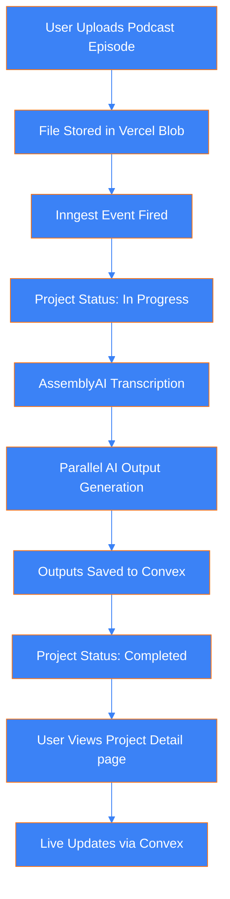

---

<a id="video-walkthrough"></a>

## 🎥 Video Walkthrough

A fast, high-signal walkthrough of the product flow and key screens.  
This video is meant for people who want the context in moments.

<video src="readme-assets/walkthrough.mp4" controls></video>

---

<a id="ui-tour"></a>

## 🖼️ UI Tour

Each collage shows the same page in both themes (light/dark) and viewports (desktop/mobile).

### 🏠 Landing Page

Desktop + Mobile • Light + Dark
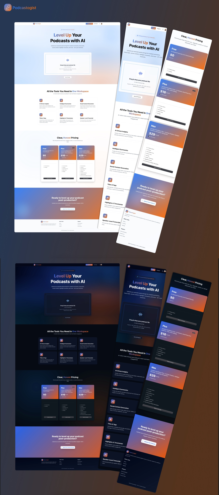

### 📤 Upload Page

Drag & drop upload UX + plan limits messaging.  
Desktop + Mobile • Light + Dark
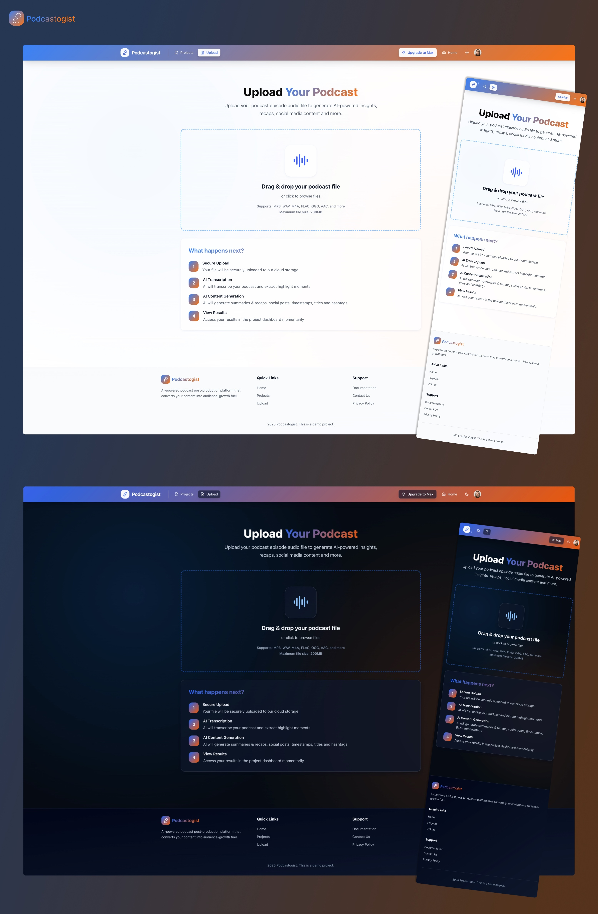

### 🧠 Project Detail — Processing

Project detail view while AI jobs are running.  
Desktop + Mobile • Light + Dark
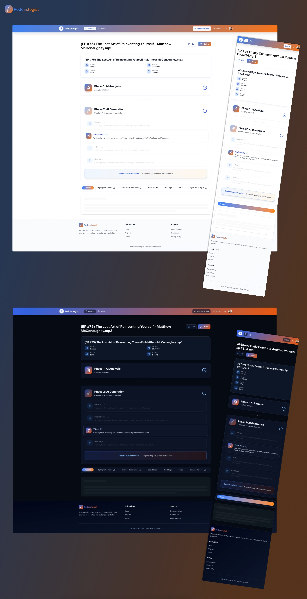

### ✅ Project Detail — Processed

Completed project with all unlocked content tabs.  
Desktop + Mobile • Light + Dark
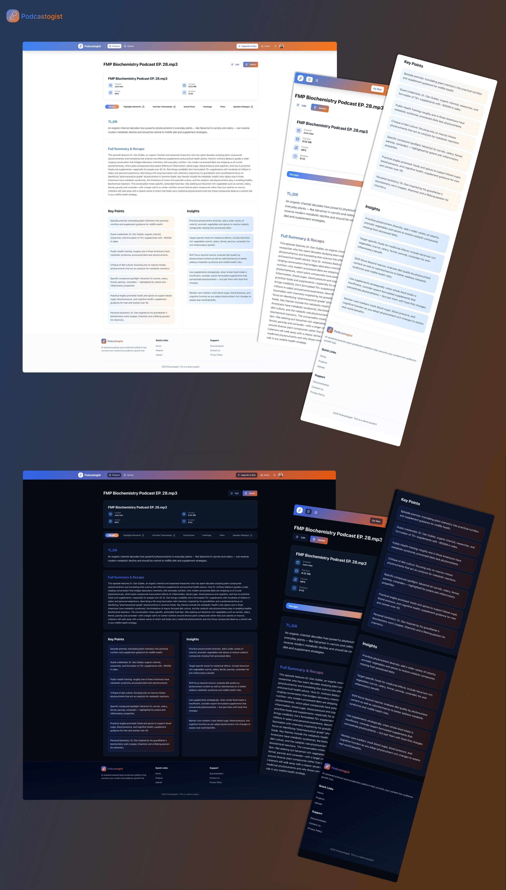

### 🔒 Project Detail — Feature Gating

Locked tab with upgrade prompt and plan benefits.  
Desktop + Mobile • Light + Dark


### 📚 Projects Page — Processing

Multiple projects running with live status updates.  
Desktop + Mobile • Light + Dark


### 📂 Projects Page — Completed

Multiple finished projects in the dashboard.  
Desktop + Mobile • Light + Dark


### 🧼 Projects Page — Empty State

First-time user experience with empty projects list.  
Desktop • Light + Dark
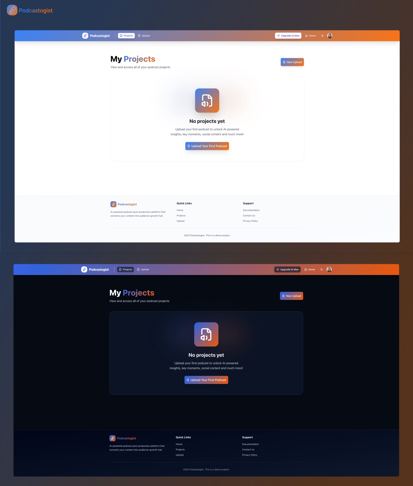

### 💳 Upgrade Page

Plan comparison and upgrade CTAs.  
Desktop • Light + Dark


---

<a id="plans--limits"></a>

## 💳 Plans & Limits

Pricing and limits are enforced consistently in UI, server actions, and API routes.

### 💰 Plan Pricing

| Plan | Price     | Summary                                                          |
| ---- | --------- | ---------------------------------------------------------------- |
| Free | $0        | Recaps only — try the workflow with strict limits                |
| Plus | $21/month | Social posts + titles + hashtags                                 |
| Max  | $34/month | Full intelligence pack: timestamps, highlights, speaker dialogue |

_Note:_ Not a real commercial SaaS. This is a demonstration project.  
Podcastogist is a fully working platform built for podcast post-production jobs & content kit generation.  
Billing runs in test mode (Clerk/Stripe), **so no real charges are processed.**

### 📏 Plan Limits

| Plan | Max Projects                | Max File Size | Max Duration |
| ---- | --------------------------- | ------------- | ------------ |
| Free | 3 (lifetime, incl. deleted) | 10MB          | 10 minutes   |
| Plus | 30 (active only)            | 200MB         | 2 hours      |
| Max  | Unlimited                   | 3GB           | Unlimited    |

**Edge cases (intended behavior):**

- Free plan counts lifetime projects (including deleted).
- Plus plan counts active projects (deleting frees slots).
- Max plan removes quota limits but still enforces file type validation.

### 🧷 Enforcement Points

- Client-side pre-validation in the upload flow.
- Server-side validation in `validateUploadAction`.
- API route enforcement in `/api/upload`.
- Convex project counting (Free plan counts deleted projects, Plus plan counts active).

---

<a id="feature-gating-matrix"></a>

## 🧱 Feature Gating Matrix

This is enforced by Clerk Billing features and app-side checks.

| Feature            | Free | Plus | Max |
| ------------------ | ---- | ---- | --- |
| Recaps             | ✅   | ✅   | ✅  |
| Social Posts       | ❌   | ✅   | ✅  |
| Titles             | ❌   | ✅   | ✅  |
| Hashtags           | ❌   | ✅   | ✅  |
| YouTube Timestamps | ❌   | ❌   | ✅  |
| Highlight Moments  | ❌   | ❌   | ✅  |
| Speaker Dialogue   | ❌   | ❌   | ✅  |

### 🧠 Why this gating exists

- AI costs scale with file length and number of outputs.
- Free proves value; Plus unlocks distribution outputs.
- Max unlocks deep intelligence (timestamps, highlights, speaker dialogue).

---

<a id="how-gating-works"></a>

## 🔐 How Gating Works

Feature access is enforced at multiple layers to prevent bypass.

**Plan detection (Clerk):**

- `has({ plan: "free" | "plus" | "max" })` is used to determine access.
- Feature availability is mapped in `PLAN_FEATURES`.

**UI gating:**

- Locked tabs show an Upgrade Prompt with plan details.
- Feature tabs are wrapped with `Protect` to guard access.

**Workflow gating:**

- Inngest pipeline conditionally schedules AI jobs by plan.
- Recaps always run; advanced tasks only run for Plus/Max.

---

<a id="architecture-overview"></a>

## 🏗️ Architecture Overview

End-to-end pipeline from upload to real-time results.

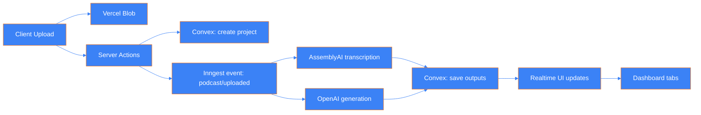

### 🗺️ Data Boundaries (what lives where)

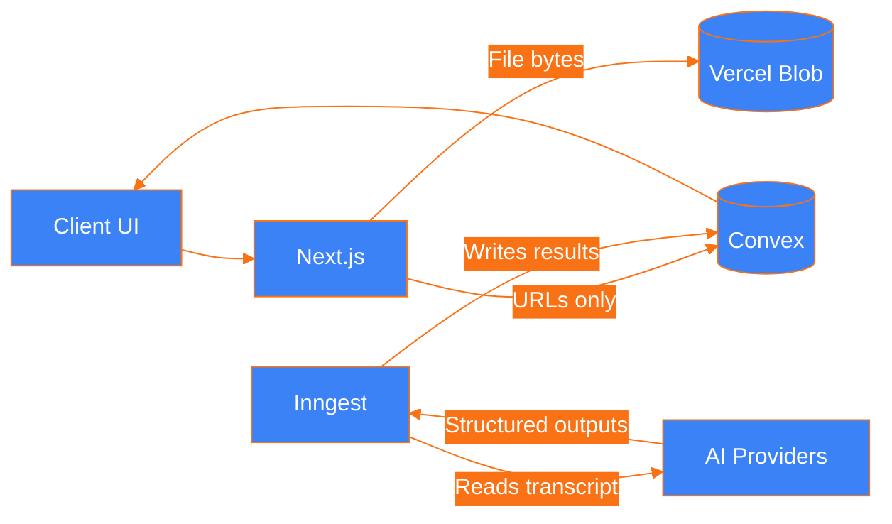

---

<a id="parallel-orchestration"></a>

## ⚡ Parallel Orchestration

AI generation runs in parallel to reduce total time.

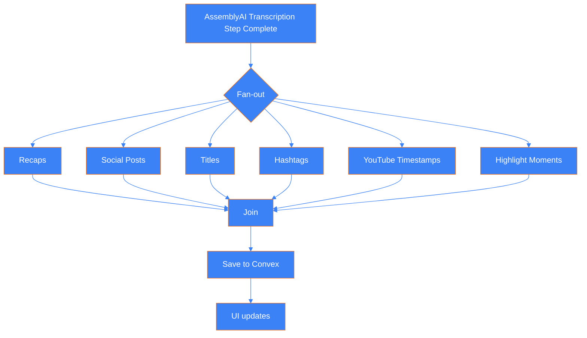

**Execution detail:**

- Uses `Promise.allSettled` to allow partial success.
- Errors are tracked per job and saved to `jobErrors`.
- Retry flow regenerates a single failed output without rerunning the entire pipeline.

---

<a id="long-running-file-handling"></a>

## 🕰️ Long-Running File Handling

Long transcriptions are handled asynchronously to avoid server timeouts.

**Key mechanism:**

- AssemblyAI transcription is submitted with a webhook URL.
- Inngest `step.waitForEvent` waits for `assemblyai/transcript.status`.
- The webhook endpoint (`/api/webhooks/assemblyai`) forwards status events to Inngest.

**Why this matters:**

- No long HTTP requests in Next.js server functions.
- Durable wait with retries if webhooks fail.
- The UI remains responsive and accurate throughout processing.

### 🧵 Webhook-driven flow

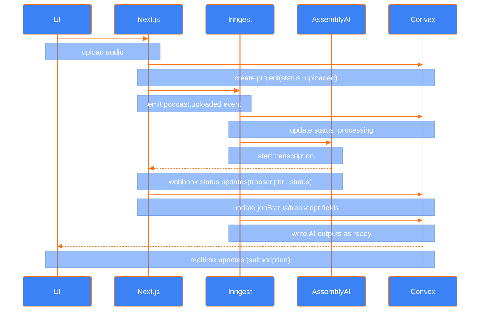

---

<a id="api-surface"></a>

## 🧩 API Surface

These endpoints enable the full workflow while keeping UI clean.

### 🧭 Public routes used by the app

- `POST /api/upload` → generates Vercel Blob upload tokens.
- `POST /api/inngest` → Inngest webhook endpoint for execution.
- `POST /api/webhooks/assemblyai` → AssemblyAI webhook receiver.

### 🧾 Server actions used by the client

- `validateUploadAction` → plan limit validation.
- `createProjectAction` → create project + trigger Inngest event.
- `deleteProjectAction` → delete project + blob cleanup.
- `generateMissingFeatures` → generate newly unlocked features after upgrade.

---

<a id="event-contracts"></a>

## 📡 Event Contracts

Inngest events are strongly typed and used to orchestrate work.

### 📤 Event: `podcast/uploaded`

```json
{
  "name": "podcast/uploaded",
  "data": {
    "projectId": "<convex_id>",
    "userId": "<clerk_user_id>",
    "plan": "free | plus | max",
    "fileUrl": "https://<blob_url>",
    "fileName": "episode-42.mp3",
    "fileSize": 12345678,
    "mimeType": "audio/mpeg"
  }
}
```

### 🔁 Event: `podcast/retry-job`

```json
{
  "name": "podcast/retry-job",
  "data": {
    "projectId": "<convex_id>",
    "job": "socialPosts | titles | hashtags | highlightMoments | youtubeTimestamps | recaps",
    "userId": "<clerk_user_id>",
    "originalPlan": "free | plus | max",
    "currentPlan": "free | plus | max"
  }
}
```

### 📥 Event: `assemblyai/transcript.status`

```json
{
  "name": "assemblyai/transcript.status",
  "data": {
    "projectId": "<convex_id>",
    "transcriptId": "<assemblyai_id>",
    "status": "completed | error",
    "error": "<error_message>"
  }
}
```

---

<a id="data-model"></a>

## 🗂️ Data Model

Convex uses a single denormalized `projects` table to store everything.  
This allows real-time updates and atomic writes as jobs complete.

### 🧾 Project Document (conceptual example)

```ts
{
  _id: "projects:abc123",
  userId: "user_123",
  deletedAt: undefined,
  inputUrl: "https://<blob_url>",
  fileName: "episode-42.mp3",
  displayName: "My Episode 42",
  fileSize: 12345678,
  fileDuration: 3672,
  fileFormat: "mp3",
  mimeType: "audio/mpeg",
  status: "completed",
  jobStatus: {
    transcription: "completed",
    contentGeneration: "completed"
  },
  transcript: {
    text: "...",
    segments: [
      {
        id: 0,
        start: 0,
        end: 12,
        text: "Welcome to the show...",
        words: [
          { word: "Welcome", start: 0, end: 1 },
          { word: "to", start: 1, end: 2 }
        ]
      }
    ],
    speakers: [
      {
        speaker: "A",
        start: 0,
        end: 12,
        text: "Welcome to the show...",
        confidence: 0.94
      }
    ],
    chapters: [
      {
        start: 0,
        end: 60000,
        headline: "Opening",
        summary: "Introductions and episode goals",
        gist: "intro"
      }
    ]
  },
  highlightMoments: [
    {
      time: "00:42",
      timestamp: 42,
      text: "Key takeaway",
      description: "A strong quote worth clipping"
    }
  ],
  recaps: {
    full: "Full summary...",
    bullets: ["Point one", "Point two"],
    insights: ["Insight one"],
    tldr: "One sentence hook"
  },
  socialPosts: {
    twitter: "Tweet...",
    linkedin: "LinkedIn post...",
    instagram: "IG caption...",
    tiktok: "TikTok caption...",
    youtube: "YouTube description...",
    facebook: "Facebook post..."
  },
  titles: {
    youtubeShort: ["Short title"],
    youtubeLong: ["Long title"],
    podcastTitles: ["Podcast title"],
    seoKeywords: ["keyword1", "keyword2"]
  },
  hashtags: {
    youtube: ["#podcast"],
    instagram: ["#podcast"],
    tiktok: ["#podcast"],
    linkedin: ["#podcast"],
    twitter: ["#podcast"]
  },
  youtubeTimestamps: [
    { timestamp: "0:00", description: "Intro" },
    { timestamp: "4:12", description: "Main topic" }
  ],
  error: { message, step, timestamp },
  jobErrors: { recaps, socialPosts, titles, hashtags, youtubeTimestamps, highlightMoments },
  createdAt: 1733420000000,
  updatedAt: 1733420500000,
  completedAt: 1733420600000
}
```

**Indexes:** `by_user`, `by_status`, `by_user_and_status`, `by_created_at`.

---

<a id="project-status-model"></a>

## 🧭 Project Status Model

Status is used to drive UI state and processing feedback.

### 📍 Primary status

- `uploaded` → project created, waiting to process.
- `processing` → Inngest workflow running.
- `completed` → all scheduled jobs finished.
- `failed` → workflow or a critical step failed.

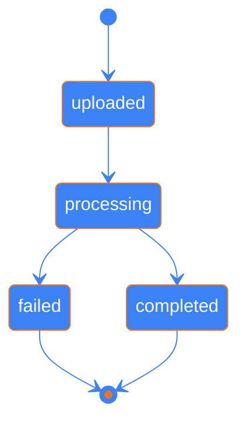

### 🧩 Job status (granular)

- `transcription`: pending → running → completed/failed.
- `contentGeneration`: pending → running → completed/failed.

### 🧯 Per-job errors

- Individual AI jobs record errors inside `jobErrors`.
- The UI surfaces per-tab retries for only the failed output.

---

<a id="storage-layout"></a>

## 🗃️ Storage Layout

Storage is split between Blob (files) and Convex (structured results).

**Vercel Blob:**

- Input audio files stored via direct client upload.
- Public URLs with randomized suffixes.

**Convex:**

- Stores metadata + AI outputs.
- Stores transcript structure (segments, chapters, speakers).

**Example key structure (conceptual):**

- `blob://uploads/{userId}/{random}.mp3`
- `blob://uploads/{userId}/{random}.wav`

---

<a id="security-model"></a>

## 🛡️ Security Model

Podcastogist is designed for practical, application-level security.

**Access control:**

- Clerk enforces authentication at the app boundary.
- Convex queries/mutations are user-scoped.

**Blob access model:**

- Vercel Blob client uploads require `access: "public"`.
- URLs are unlisted and stored privately in Convex.
- Projects are only accessible to the owning user.

**Practical outcome:**

- Public blob URLs exist, but access is effectively private by design.
- This is appropriate for podcast media workflows.

---

<a id="observability"></a>

## 📈 Observability

High-signal visibility across every stage of the pipeline.

- Inngest: step runs, retries, and execution history.
- Convex: mutation/query logs and realtime subscriptions.
- Vercel: request/runtime logs + Blob activity.
- Providers: AssemblyAI + OpenAI dashboards for usage and errors.

---

<a id="ai-generation-engine"></a>

## 🧠 AI Generation Engine

OpenAI is used for recaps, posts, titles, and hashtags.

**Key characteristics:**

- Model: `gpt-5-mini` (fast, cost-effective).
- Structured outputs enforced via Zod schemas.
- Inngest `step.ai.wrap()` ensures observability and retries.

**Why structured outputs matter:**

- Enforces predictable JSON shape.
- Prevents UI breakage from malformed model output.
- Keeps type safety consistent across the stack.

---

<a id="assemblyai-transcription"></a>

## 🎧 AssemblyAI Transcription

AssemblyAI is used for high-quality transcription and audio intelligence.

**Enabled features:**

- Speaker diarization (always captured).
- Auto chapters (topic detection with summaries).
- Word-level timestamps.
- Formatted text (punctuation + capitalization).

**Design rationale:**

- Strong diarization performance.
- Async transcription API fits durable workflows.
- Chapters provide reliable timing for highlights and YouTube timestamps.

---

<a id="prompt--schema-discipline"></a>

## 🧬 Prompt & Schema Discipline

Prompting is structured and reproducible across all AI steps.

**Prompts include:**

- Partial transcript text for context.
- AssemblyAI chapters for structure.
- Platform-specific rules and constraints.

**Schemas enforce:**

- Output shape for recaps, titles, posts, hashtags.
- Minimum/maximum array lengths.
- Character limits (Twitter/X).

---

<a id="real-time-updates"></a>

## 📡 Real-time Updates

Convex makes the UI reactive without manual polling.

**What updates in real-time:**

- Project list as uploads complete.
- Project detail tabs as AI outputs arrive.
- Processing status and progress states.

**Why this matters:**

- UI feels “live” even for long processing steps.
- Users always see accurate status from the database.

---

<a id="retry--regeneration"></a>

## ♻️ Retry & Regeneration

Podcastogist supports selective regeneration.

**Retry flow:**

- Failed tabs can be retried individually.
- Inngest function reuses stored transcript data.
- Job errors clear automatically after success.

**Upgrade flow:**

- Upgrading plans unlocks new features.
- A single action generates all missing outputs.

**Performance choices:**

- Parallel AI fan-out (Promise.allSettled).
- Async transcription via webhooks.
- No polling thanks to Convex subscriptions.
- Client-side direct Blob uploads for large files.

---

<a id="failure-modes--recovery"></a>

## 🧯 Failure Modes & Recovery

This system is built to behave predictably when things go wrong.

| Area          | Failure                | User impact               | Recovery behavior           |
| ------------- | ---------------------- | ------------------------- | --------------------------- |
| Upload        | file too large         | blocked before processing | clear error + upgrade CTA   |
| Upload        | unsupported type       | blocked                   | supported formats listed    |
| Upload        | blob upload fails      | project not created       | retry upload                |
| Transcription | AssemblyAI error       | no outputs                | project marked failed       |
| Webhook       | late/duplicate webhook | delayed updates           | idempotent handling         |
| Generation    | OpenAI error           | missing outputs           | per-job retry               |
| Gating        | locked feature access  | upgrade prompt            | no compute runs             |
| Limits        | duration exceeds plan  | blocked early             | limit message shown         |
| Realtime      | subscription drop      | stale UI                  | auto reconnect/refresh      |
| Deletion      | project removed        | disappears from list      | Free counts include deleted |

---

<a id="tradeoffs"></a>

## ⚖️ Tradeoffs

Deliberate choices to balance reliability, speed, and scope.

**Chosen intentionally:**

- Managed services for faster iteration and fewer ops burdens.
- Durable workflows instead of long-running API requests.
- Realtime subscriptions instead of client polling.
- Progressive enrichment instead of “all-or-nothing” output.
- Direct-to-Blob uploads for large files.

**Not chosen (for this scope):**

- Self-hosted workers and queues.
- One mega prompt for all outputs.
- Storing raw audio in the database.
- Hard-blocking UI until all outputs finish.
- Private blob access with signed URLs (future enhancement).

---

<a id="design-system--ui"></a>

## 🎨 Design System & UI

The UI is built to feel premium and confident.

**Visual system:**

- Gradient sunrise theme (blue → orange).
- Glassmorphism cards with soft elevation.
- Clear hierarchy with bold typography.

**Interaction design:**

- Copy-to-clipboard actions for outputs.
- Progress indicators tied to real-time data.
- Upgrade prompts placed at the moment of need.

---

<a id="ux-details"></a>

## 🧭 UX Details

Micro-interactions and layout decisions that improve usability.

**Upload UX:**

- Immediate file validation feedback.
- Duration display before upload starts.
- Clear upload status states.

**Dashboard UX:**

- Tabs for outputs to prevent scrolling fatigue.
- Distinct states for processing vs completed.
- Empty state guidance for first-time users.
- Processing shown as a pipeline, not just a spinner.

**Accessibility:** ARIA-labeled theme toggle, focusable actions, and contrast-safe colors.

---

<a id="tech-stack"></a>

## 🧰 Tech Stack

A modern, production-grade stack optimized for SaaS workflows.

**Frontend:**

- Next.js 16 (App Router).
- React 19 + TypeScript.
- Tailwind CSS v4 + shadcn/ui + Radix UI.
- Lucide icons + react-social-icons.
- Sonner for toast feedback.

**Backend & Infrastructure:**

- Clerk (auth + billing + feature gating).
- Convex (realtime DB + reactive queries).
- Inngest (durable background jobs).
- AssemblyAI (transcription + diarization).
- OpenAI GPT-5-mini (content generation).
- Vercel Blob (large file storage + direct uploads).

**Quality & DX:**

- Zod for schema validation.
- Biome for linting/formatting.
- Typed AI outputs via Structured Outputs.

---

<a id="repo-map"></a>

## 🗺️ Repo Map

Key directories and their roles.

- `app/` → Next.js App Router pages + API routes.
- `components/` → UI components, tabs, upload flow, layout.
- `actions/` → Server actions for uploads, projects, retries.
- `convex/` → Schema + queries + mutations.
- `inngest/` → Workflow functions and AI steps.
- `lib/` → Shared utilities, types, constants, clients.
- `schemas/` → Zod schemas for AI outputs.
- `public/` → Runtime app assets.
- `readme-assets/` → README-only assets (hero, collages, video).

---

<a id="engineering-notes"></a>

## 🧪 Engineering Notes

These are the decisions that made the product reliable.

### 🧱 Upload Flow (Large Files)

- Direct Blob upload via `@vercel/blob/client`.
- Server action pre-checks prevent wasted uploads.
- API route enforces plan-based size limits.

### 🔄 Durable Orchestration

- Inngest functions run steps with retries and observability.
- Transcription waits on webhook events (not HTTP timeouts).
- Parallel steps run independently to avoid cascading failures.

### 📚 Data & State

- Convex schema supports progressive updates.
- `jobStatus` enables granular UI progress.
- `jobErrors` supports per-feature retry.

### 🔑 Plan Enforcement

- Clerk billing features map directly to app capabilities.
- Free tier project count includes deleted projects.
- Plus tier counts only active projects (fair usage).

---

<a id="build-challenges"></a>

## 🧗 Build Challenges

What required real engineering problem-solving.

**1) Long-running transcription on serverless**

- Solved using AssemblyAI webhooks + Inngest durable waits.

**2) Large file uploads**

- Solved with direct-to-Blob uploads and server-side size constraints.

**3) Plan gating without security holes**

- Solved with multi-layer enforcement in UI, server actions, and routes.

**4) Partial failure tolerance**

- Solved with `Promise.allSettled` and per-job error tracking.

**5) Real-time UX**

- Solved with Convex subscriptions and atomic mutations.

---

<a id="build-timeline"></a>

## ⏳ Build Timeline

The project was built in an intense sprint schedule.

**Timeline (2025):**

- Dec 6 → Dec 20: Core build + architecture.
- Dec 21 → Dec 26: Packaging, video walkthrough, README prep.
- Total effort: ~194 hours.

---

<a id="roadmap"></a>

## 🔮 Roadmap

Future enhancements that would extend the product.

**Product expansions:**

- Batch processing for multiple episodes.
- Multi-language transcription and translation (currently only English is supported)
- Custom brand voice profiles for AI outputs.
- Export packs (PDF / Notion / Google Docs).

**Distribution enhancements:**

- Social scheduling integrations (Buffer, Hootsuite).
- Analytics dashboard for content performance.
- A/B testing for titles and hooks.

**Workflow upgrades:**

- Captions/SRT export.
- Team workspaces and roles.
- Webhook notifications when processing completes.

---

<a id="glossary"></a>

## 📚 Glossary

A quick reference for reviewers and recruiters.

- **Inngest** → Durable job orchestration layer.
- **Convex** → Real-time database with reactive queries.
- **Clerk** → Authentication + billing + plan gating.
- **AssemblyAI** → Speech-to-text + audio intelligence.
- **OpenAI GPT-5-mini** → LLM used for content generation.
- **Vercel Blob** → Object storage for uploaded audio files.
- **Plan gating** → Feature access based on subscription tier.
- **Diarization** → Identifying who spoke in a transcript.
- **Auto chapters** → AssemblyAI topic segmentation.
- **Structured outputs** → LLM responses constrained by Zod schemas.

---

<a id="demo-disclaimer"></a>

## 🧾 Demo Disclaimer

Not a real commercial SaaS. This is a demonstration project.  
Podcastogist is a fully working platform built for podcast post-production jobs & content kit generation.  
Billing runs in test mode (Clerk/Stripe), **so no real charges are processed.**

---

<a id="contact"></a>

## 📬 Contact

- GitHub Issues: https://github.com/lindsaycode05/podcastogist/issues
- Email: lindsaycode05@gmail.com
- LinkedIn: https://www.linkedin.com/in/lindsaycode/
